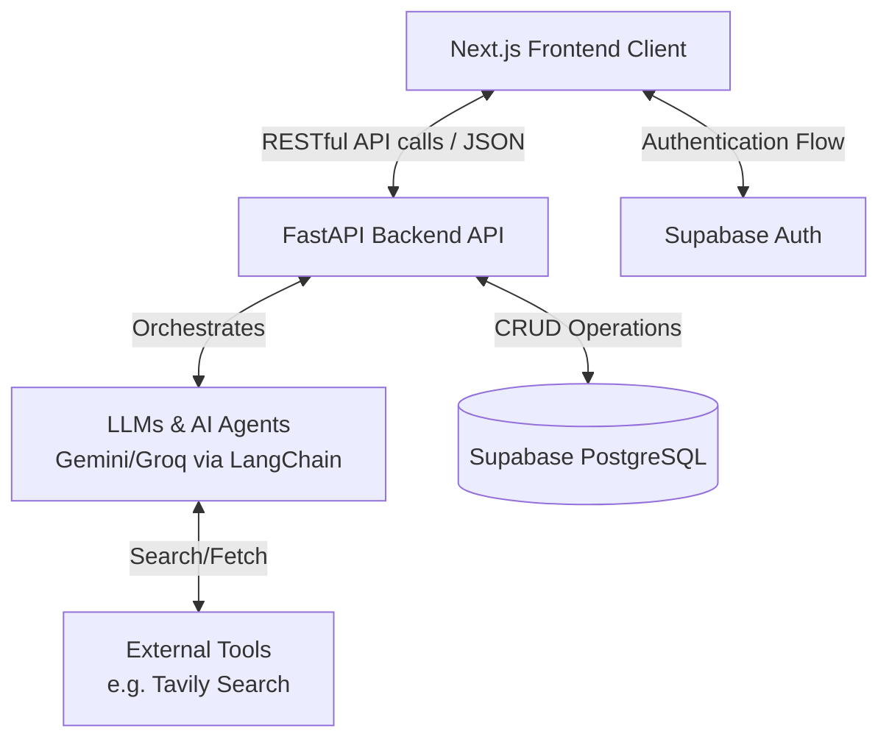
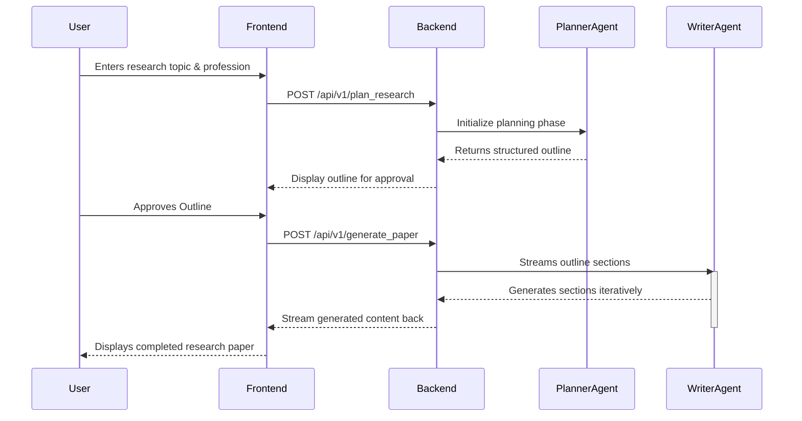

# MAARS Enterprise

**Multi-Agent Autonomous Research System Enterprise**

MAARS Enterprise is a next-generation autonomous research platform that leverages multi-agent AI frameworks to automate the planning, generation, and curation of comprehensive research papers and documents.

## 🚀 Features

- **Autonomous Research Generation**: Describe a topic, and MAARS will autonomously generate an outline and draft a comprehensive paper.
- **Multi-Agent Architecture**: Under the hood, specialized AI agents handle distinct phases of research (Planning, Writing, Editing, Review).
- **Interactive Planner**: Review and approve research outlines before the system commits to generating the full content.
- **Enterprise Authentication**: Secure user login and profile management powerd by Supabase.
- **Library Management**: Publish research to the community or save it to your private library.
- **Export Options**: Download generated papers with ease.

## 💻 Tech Stack

### Frontend
- **Framework**: Next.js 14 (App Router)
- **UI Library**: React 18, Tailwind CSS, Lucide React
- **Authentication**: Supabase Auth (SSR)

### Backend
- **Framework**: FastAPI (Python)
- **AI/LLM orchestration**: LangChain, LangChain-Google-Genai, Groq
- **Tools**: Tavily (Search capability), Python-docx, fpdf2 (Document generation)

## 📂 Project Structure

```text
maars-enterprise/
├── frontend/               # Next.js Application
│   ├── app/                # Main application routes (/login, /signup, etc.)
│   ├── components/         # Reusable React components
│   │   ├── features/       # Feature-specific components (e.g. auth, dashboard, editor)
│   │   ├── layout/         # Layout components (Header, Sidebar)
│   │   └── ui/             # Generic UI elements (Buttons, Inputs, Cards)
│   ├── hooks/              # Custom React hooks
│   ├── lib/                # Utility libraries and configurations (Supabase client)
│   └── utils/              # Helper functions
│
└── backend/                # FastAPI Application
    ├── app/
    │   ├── api/            # API Route definitions (v1)
    │   ├── core/           # Core configurations and settings
    │   ├── models/         # Pydantic schemas and database models
    │   ├── repositories/   # Data access layer
    │   └── services/       # Business logic and AI Agent orchestrations
    ├── tests/              # Backend test suites
    ├── requirements.txt    # Python dependencies
    └── run.py              # Application entry point
```

## 🔄 Data Flow Diagrams

### High-Level System Architecture



### Autonomous Research Flow



## 🛠️ Setup Instructions

### Prerequisites
- Node.js (v18+)
- Python (3.10+)
- Supabase account & project
- LLM API Keys (Google Gemini Private Key / Groq)
- Tavily API Key

### 1. Environment Variables

Create `.env` files in both frontend and backend directories.

**Frontend (`frontend/.env.local`)**:
```env
NEXT_PUBLIC_SUPABASE_URL=your_supabase_url
NEXT_PUBLIC_SUPABASE_ANON_KEY=your_supabase_anon_key
```

**Backend (`backend/.env`)**:
```env
GOOGLE_API_KEY=your_gemini_key
GROQ_API_KEY=your_groq_key
TAVILY_API_KEY=your_tavily_key
```

### 2. Run Backend
```bash
cd backend
python -m venv .venv
source .venv/bin/activate  # On Windows: .venv\Scripts\activate
pip install -r requirements.txt
python run.py
```

### 3. Run Frontend
```bash
cd frontend
npm install
npm run dev
```

Visit `http://localhost:3000` to start using MAARS Enterprise.
